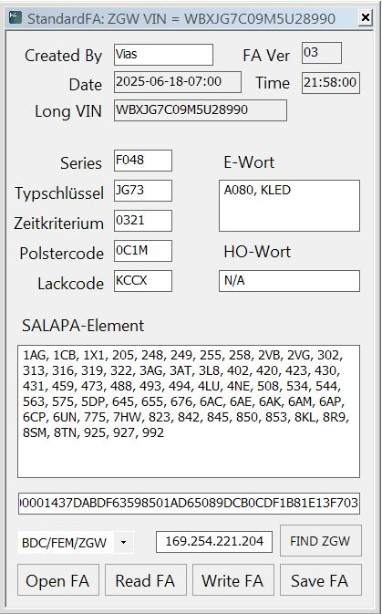

# BMW StandardFA

This project provides a simple example for reading, decoding, modifying, signing, and writing FA data through the ZGW (Gateway).

---

## 🔧 Features

- Encode and decode FA data between binary format and readable fields (e.g., Zeitkriterium, Series, Type, Salapas)
- Generate UDS command payload by combining FA data and HMAC-SHA1 signature
- Open and save FA data to XML files for easier editing and storage   

---

## How It Works

- **Finding ZGW**: Automatically searches for the ZGW IP address on the network.
- **Reading FA**: Connects to ZGW, reads VIN and SVK, retrieves FA data, decodes into structured data.  
- **Modifying FA**: User edits fields, the code encodes the updated FA.  
- **Signing FA**: FA data is signed using HMAC-SHA1 with a key selected based on SVK.  
- **Saving FA**: Allows exporting the decoded and modified FA data to an XML file.  
- **Writing FA**: Sends the constructed UDS command to the ZGW module to update the vehicle order data.  
  

---